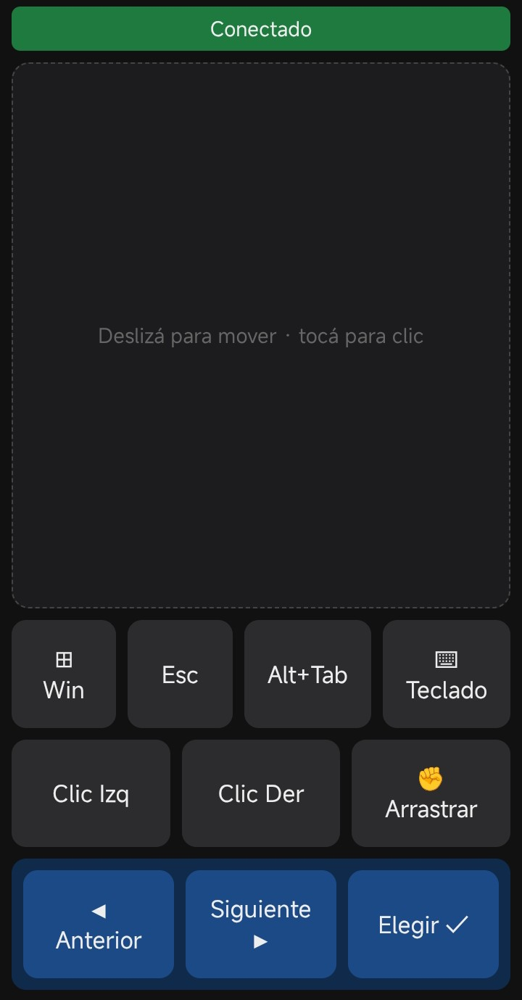

# Control Remoto PC ↔ Celular — Usá tu Android como mouse y teclado de Windows por WiFi

Convertí tu teléfono Android en un **touchpad inalámbrico** y **teclado remoto** para tu PC con Windows. Sin apps que instalar en el celular, sin cables, sin cuentas: abrís un `.exe`, escaneás un QR y listo. Controlás el mouse, escribís texto, arrastrás iconos y mandás teclas como `Win`, `Esc` y `Alt+Tab` desde el celular, por la red WiFi local.


<p align="center">
  
</p>

## ✨ Características

- 🖱️ **Touchpad inalámbrico** — mové el cursor deslizando el dedo, tocá para hacer clic.
- 👆 **Arrastrar y soltar** — mantené el botón de clic y movés otro dedo en el pad (arrastrar iconos, seleccionar texto, mover ventanas).
- ⌨️ **Teclado del celular** — escribí en cualquier campo de la PC (buscador de YouTube, navegador, etc.) usando el teclado del teléfono.
- 🔑 **Teclas especiales** — `Win`, `Esc` (salir de apps a pantalla completa) y `Alt+Tab` con **modo selección** (el conmutador de ventanas queda abierto hasta que elegís).
- 📜 **Scroll táctil natural** — desplazá con dos dedos como en el celular.
- 📷 **Conexión por QR** — sin escribir IPs: escaneás el código y se abre el control en el navegador.
- 🔌 **Cero instalación en el celular** — funciona desde Chrome; opcional "agregar a la pantalla de inicio" (PWA).
- 🚀 **Un solo `.exe`** — el usuario final no necesita Python ni instalar nada en la PC.

## ⚡ Inicio rápido (usuario final)

1. Descargá `ControlRemoto.exe` y hacé doble clic.
   - La primera vez Windows SmartScreen puede avisar: **Más información → Ejecutar de todas formas**.
2. En la ventana aparece un **código QR**. Escaneálo con la cámara del celular (PC y teléfono en la **misma red WiFi**).
3. Se abre el control en el navegador del celular. ¡A controlar la PC!

> ¿No querés escanear? También se muestra la URL (ej. `http://192.168.1.20:8000`) para abrir a mano en Chrome.

## 🎮 Cómo se usa

| Acción en el celular | Resultado en la PC |
|---|---|
| Deslizar un dedo en el pad | Mover el cursor |
| Tocar el pad | Clic izquierdo |
| Botón **Clic Izq / Der** | Clic izquierdo / derecho |
| Mantener **Clic Izq** + mover otro dedo en el pad | Arrastrar y soltar |
| Dos dedos arriba/abajo | Scroll |
| Botón **⌨ Teclado** | Abre el teclado del celular y transmite el tipeo |
| **Win** / **Esc** | Tecla Windows / Escape |
| **Alt+Tab** → ◀ ▶ → Elegir ✓ | Conmutador de ventanas con selección |

## 🛠️ Desarrollo

Requisitos: Python 3.10+ en Windows.

```bash
pip install -r requirements.txt
python server.py        # o doble clic en iniciar.bat
```

- **Tests:** `pytest -v`
- **Generar el ejecutable:** `build.bat` → `dist/ControlRemoto.exe`

### Arquitectura

- **Backend:** Python + Flask + flask-sock (WebSocket) + [pynput](https://github.com/moses-palmer/pynput) para inyectar mouse/teclado en Windows.
- **Cliente:** HTML/CSS/JavaScript puro (sin dependencias), servido por la PC y abierto en el navegador del celular.
- **Protocolo:** mensajes JSON por WebSocket (mover, clic, press/release, scroll, teclas, tipeo).
- **Red:** el servidor escucha en `0.0.0.0`, detecta la **IP local** de la PC y el **primer puerto libre desde 8000**, y arma el QR con esa URL.

## ❓ Preguntas frecuentes

**¿Funciona por Internet o solo en WiFi?**
Solo en la **red local (LAN)**. El celular y la PC tienen que estar en la misma WiFi. No se expone nada a Internet.

**¿Necesito instalar una app en el celular?**
No. Se usa el navegador (Chrome recomendado). Opcionalmente podés "agregarlo a la pantalla de inicio".

**¿Necesito Python en la PC?**
No para usar el `.exe`. Sí para desarrollar o compilarlo.

**¿Sirve para iPhone?**
Está pensado y probado para **Android**, pero al ser una página web debería abrir en Safari (no testeado).

**¿Es seguro?**
Es de uso en tu red doméstica. No incluye PIN por defecto (pensado para una LAN de confianza). No lo expongas a redes públicas.

## 🤝 Contribuciones

Issues y pull requests son bienvenidos.

## 📄 Licencia

[MIT](LICENSE) © 2026 Luciano Rafael Flores
